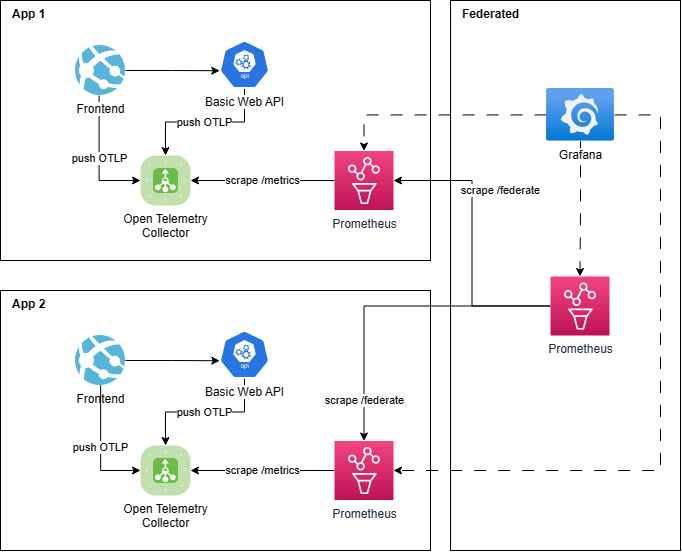
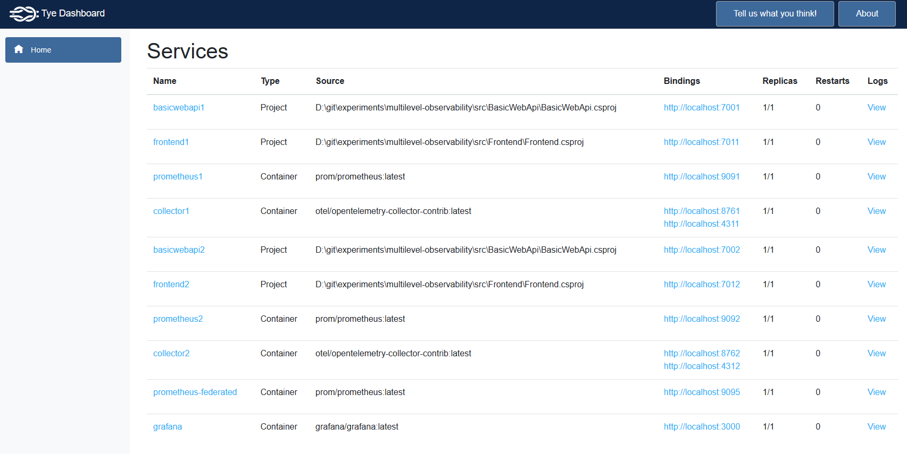
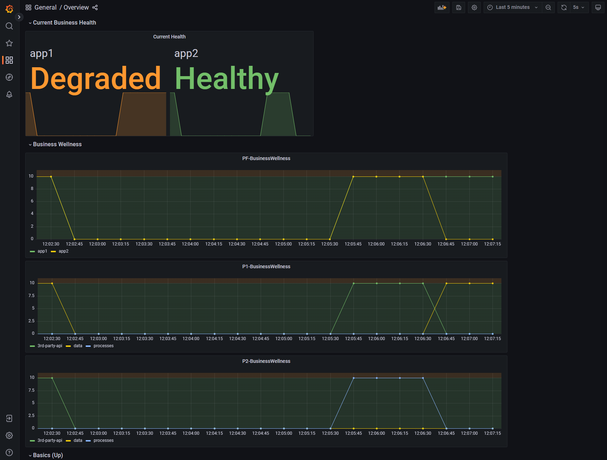

# Federating Prometheus

This repository can be used to demonstrate how different applications,
each with its own Prometheus instance can still get a "combined" view
in a single prometheus instance which is using Federation
to fetch metrics from the application prometheus instances.

This looks a bit like this (don't mind that I just took the first icons draw.io suggested me for my queries..):

In this demonstration, two "applications" are run, each
with a "frontend" (named frontend) and a "backend" (named basicwebapi).
Each application has it's own OpenTelemetry-Collector 
and Prometheus containers running.

Additionally there is one "Federating prometheus" and a Grafana instance.
The Grafana instance automatically gets provisioned the 3 prometheus data sources
and a simple Overview dashboard.

Currently only the frontend is pushing metrics to the OpenTelemetry Collector.
However this could easily be extended to the backend as well.

The frontend exposes some artificial `business_wellness` using a [BusinessWellnessHostService](./src/Frontend/BusinessWellnessHostService.cs).
Where a value of 0 means `Healthy`, a value of 10 `Degraded` and a value of 20 `Unhealthy`.

And the collector applies some `app` label to all metrics, also see [collector 1 config](./config/collector-config-1.yaml) as example.

All the different configurations and dashboard are stored in [config](./config).

## Requirements

To be able to run this demonstration, you need:

- [.NET 6.0 SDK](https://dotnet.microsoft.com/en-us/download)
- [Docker Desktop](https://www.docker.com/products/docker-desktop/)
- [Tye](https://github.com/dotnet/tye/blob/main/docs/getting_started.md)

## How to start demo

In the root of this project, execute: `tye run`

This causes some docker containers to be started, the projects being built 
and run, etc. Basically the whole orchestration is done with tye.
For details check [tye.yaml](tye.yaml) and the [tye documentation](https://github.com/dotnet/tye/blob/main/docs/README.md).

## Access to different parts of the Demo

The easiest way is to open the [Tye Dashboard](http://127.0.0.1:8000/):

From there you may access e.g. a frontend ([frontend1](http://localhost:7011/) / [frontend2](http://localhost:7012/))
by clicking on the blue binding link in the fourth column.
Similarly most other containers can be reached that way 
(collectors only return useful information on e.g.: [/metrics](http://localhost:8761/metrics))

The most interesting thing probably is [Grafana](http://localhost:3000/d/By0zyeY4k/overview) - but it takes some time 
until the metrics are actually produced, collected, fetched and federated.
So be patient. :)

The result could look like this:

