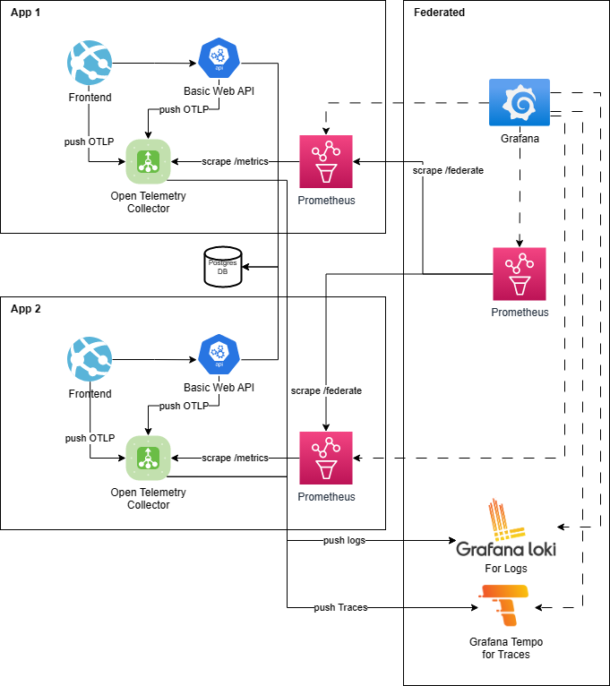

# Federating Prometheus

This repository can be used to demonstrate how different applications,
each with its own Prometheus instance can still get a "combined" view
in a single prometheus instance which is using Federation
to fetch metrics from the application prometheus instances.

This looks a bit like this (don't mind that I just took the first icons draw.io suggested me for my queries..):

In this demonstration, two instances of the same "application stack" are run, each
with a "frontend" (named frontend) and a "backend" (named basicwebapi).
Each "application stack" has it's own OpenTelemetry-Collector 
and Prometheus containers running.

Additionally there is one of each:
- "Federating prometheus" instance for Metrics across applications
- central Grafana instance for Dashboarding everything
- central Postgres DB (for simplicity and laziness reasons)
- central Grafana Loki instance (for Logs, also simplicity)
- central Tempo instance (for Traces - I wouldn't know if we could "stitch together" multiple traces from multiple Tempo instances to be honest..)

The Grafana instance automatically gets provisioned the 3 prometheus data sources, as well as Tempo and Loki data sources and also gets configured so that the Logs might get associated with Traces. Also a simple Overview dashboard gets provisioned automatically as well.

The frontend as well as the basicWebApi are pushing metrics, traces and Logs to the OpenTelemetry Collector all using OTLP.

The frontend as well as the backend expose some artificial `business_wellness` using a [BusinessWellnessHostService](./src/Frontend/BusinessWellnessHostService.cs) in [both cases](./src/BasicWebApi/BusinessWellnessHostService.cs).
Where a value of 0 means `Healthy`, a value of 10 `Degraded` and a value of 20 `Unhealthy`.

The collector applies some `app` label to all metrics, also see [collector 1 config](./config/collector-config-1.yaml) as example.

All the different configurations and dashboard are stored in [config](./config).

## Requirements

To be able to run this demonstration, you need:

- [.NET 6.0 SDK](https://dotnet.microsoft.com/en-us/download)
- [Docker Desktop](https://www.docker.com/products/docker-desktop/)
- [Tye](https://github.com/dotnet/tye/blob/main/docs/getting_started.md)

## How to start demo

In the root of this project, execute: `tye run`

This causes some docker containers to be started, the projects being built and run, etc. Basically the whole orchestration is done with tye.
For details check [tye.yaml](tye.yaml) and the [tye documentation](https://github.com/dotnet/tye/blob/main/docs/README.md).

## Access to different parts of the Demo

The easiest way is to open the [Tye Dashboard](http://127.0.0.1:8000/):

From there you may access e.g. a frontend ([frontend1](http://localhost:7011/) / [frontend2](http://localhost:7012/))
by clicking on the blue binding link in the fourth column.
Similarly most other containers can be reached that way 
(collectors only return useful information on e.g.: [/metrics](http://localhost:8761/metrics))

The most interesting thing probably is [Grafana](http://localhost:3000/d/By0zyeY4k/overview) - but it takes some time 
until the metrics are actually produced, collected, fetched and federated.
So be patient. :)

The result could look like this:

# Update 20.04.2023

Added a way to "Create an Issue" with a tracking ID attached to that trace, allowing us to search for that TrackingId in Tempo and get to the Traces and Logs that way:

and then to get to Logs (the Label Browser query needs to be adapted slightly, just remove the `service_name="FrontentX"` part):

